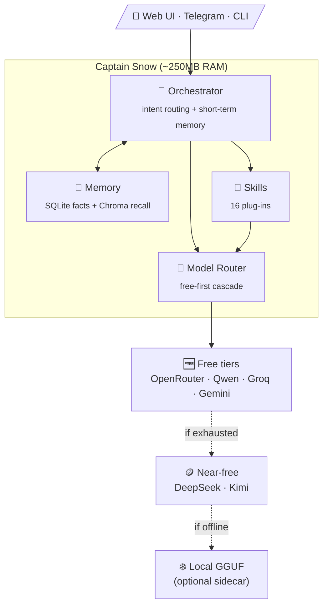

<div align="center">


# ⚓ Captain Snow

**The lightweight AI agent that runs anywhere — and costs nothing to think.**

*A $5 VPS. A Raspberry Pi. A phone. Captain Snow doesn't need a warship — a rowboat will do.*

[](LICENSE)
[](https://www.python.org/)
[](Dockerfile)
[](../../actions)
[](CONTRIBUTING.md)

[Quick Start](#-quick-start) •
[Skills](#-skills) •
[Architecture](#-architecture) •
[Security](#-security-by-default) •
[Local Inference](#-local-inference-optional) •
[Contributing](#-contributing)

</div>

---

## 🧊 Why Captain Snow?

Most self-hosted AI agents make you choose between two bad options:

| | Heavy local agents | API-first agents | ⚓ **Captain Snow** |
|---|---|---|---|
| **RAM at idle** | 4–16 GB | 1–2 GB | **~200–300 MB** |
| **Disk** | 5–40 GB (models) | 1–3 GB | **< 1 GB** |
| **Cost per month** | Hardware $$$ | $20–200+ API | **$0*** |
| **Model quality** | 7B–13B local | GPT-4-class | **70B-class (free tiers)** |
| **Runs on a phone / Pi** | ❌ | ⚠️ | ✅ |

<sub>*Routes through free-tier cloud providers (Groq, Gemini, OpenRouter, Qwen). DeepSeek/Kimi are near-free paid fallbacks you can enable — or run fully offline with the optional local model.</sub>

**The trick:** Captain Snow ships **no model at all** by default. Every request cascades through a prioritized chain of *free-tier* cloud LLMs — you get 70B-class reasoning while your hardware just runs a thin async Python process. If every free tier is down or rate-limited, it falls through to near-free paid tiers, and (optionally) a fully-offline local GGUF model as the last line of defense.

```
request ──▶ free tiers (OpenRouter → Qwen → Groq → Gemini) ──▶ near-free (DeepSeek → Kimi) ──▶ local GGUF (optional)
```

## ⚔️ What he does

- 💬 **Chat everywhere** — web UI + Telegram bot + CLI, sharing one brain and one memory
- 🧠 **Remembers the conversation** — say *"yes, do it"* and he knows what *"it"* is; long-term facts persist in SQLite + Chroma and consolidate nightly
- 🔍 **Web search & SEO audits** — DuckDuckGo free (Serper optional), full on-page/technical SEO reports
- 🌐 **Real browsing** — Playwright-driven: navigate, scrape, fill forms, log into saved sites
- 📋 **Multi-step planning** — breaks big goals into executable steps and runs them
- 💳 **Stripe** — customers, charges, balances
- 📧 **Email** — send and read (IMAP/SMTP)
- 🗃️ **Airtable + Supabase + Google Workspace** — records, SQL, Sheets/Docs/Drive
- ✍️ **Content that actually publishes** — drafts to WordPress/Ghost via real REST APIs (draft-first by default)
- 🗺️ **Route optimization** — Google Maps-powered
- 📈 **Proactive monitoring** — uptime checks and data watchers that alert you on Telegram *before* you notice

Every skill is a plug-in. Don't use Stripe? Comment out one line in `config.yaml` and it's gone.

## 🚀 Quick Start

**One key is enough to sail.** Grab a free API key from [OpenRouter](https://openrouter.ai/keys) or [Groq](https://console.groq.com/keys) (no credit card needed for either).

### Docker (recommended)

```bash
git clone https://github.com/DGFcorporations/captain-snow-oss.git
cd captain-snow-oss
cp .env.example .env        # paste your key(s) into .env
docker compose up -d
```

Open `http://localhost:8000` and start talking.

### Bare Python

```bash
git clone https://github.com/DGFcorporations/captain-snow-oss.git
cd captain-snow-oss
cp config.example.yaml config.yaml
pip install -e .
export OPENROUTER_API_KEY=sk-or-...
captainsnow chat "hello, captain"
```

### Telegram

Set three variables and he's in your pocket:

```bash
TELEGRAM_BOT_TOKEN=...   # from @BotFather
TELEGRAM_OWNER_ID=...    # send /start to @userinfobot to get yours
TELEGRAM_CHAT_ID=...     # usually the same as owner id
```

> ⚠️ Without `TELEGRAM_OWNER_ID`, the bot **ignores everyone**. That's deliberate — see [Security](#-security-by-default).

## 🧩 Skills

| Skill | What it gives you |
|---|---|
| `search` | Web search (DuckDuckGo free, Serper optional) |
| `seo_core` | Full SEO audits: meta, schema, social tags, content quality, keywords |
| `browser` | Playwright browsing: navigate, scrape, forms, screenshots |
| `planner` | Multi-step plan generation and execution |
| `content` | Blog/social drafting + real WordPress/Ghost publishing |
| `email_ops` | Send and read email |
| `stripe` | Payments, customers, balances |
| `airtable` | CRUD on Airtable bases |
| `supabase_connector` | Supabase/SQL queries |
| `google_workspace` | Sheets, Docs, Drive |
| `route_optimizer` | Optimized multi-stop routes |
| `watchers` | Uptime + data monitoring with Telegram alerts |
| `revenue_consultant` | Revenue/MRR analysis and consulting prompts |
| `fileops` | Local file read/write/move |
| `agent_overseer` | Delegation and oversight across skills |

**Adding your own skill** takes one file: subclass `Skill`, implement `async def execute(self, task) -> str`, register the name. That's it — the router does the rest.

## 🏗 Architecture



```
captainsnow/
  core/
    orchestrator.py    # routes each message to a skill or general chat
    model_router.py    # provider cascade: free cloud → paid cloud → local
    memory.py          # sqlite facts + chroma semantic recall
    profile.py         # config loader, ${ENV_VAR} expansion
  skills/              # one file per capability
  ui/
    web.py             # FastAPI chat endpoint + minimal chat page
    telegram_bot.py    # long-poll bot, owner-only
    cli.py             # captainsnow chat "..."
    serve.py           # web + telegram together (Docker entrypoint)
```

## 🛡 Security by default

- 🔐 **Web chat is token-gated** — set `CAPTAINSNOW_WEB_TOKEN` and `/chat` requires a Bearer token. Unset, he warns loudly on every boot.
- 🚫 **Telegram fails closed** — no `TELEGRAM_OWNER_ID`, no replies to *anyone*. An agent holding live credentials must never be an open bot.
- 🗝 **Secrets never live in config** — `config.yaml` uses `${ENV_VAR}` expansion; startup logs tell you exactly which vars are unset.
- 🧯 **No arbitrary code execution** — deliberately. An LLM writing code + your production credentials in one process is a boarding party waiting to happen. If you need it, build it as a sandboxed add-on.
- 🤐 **Token-safe logging** — HTTP client logs that would echo bot tokens are suppressed.

## ❄️ Local inference (optional)

Want a zero-API, fully-offline fallback? Build the fat image instead:

```bash
docker build -f Dockerfile.local -t captain-snow:local .
```

It compiles `llama-server` from source and bakes in a ~1.1 GB Qwen3-1.7B (Q4_K_M) model. Then uncomment `models.local.server_url` in your config. Budget ~1 GB extra disk and ~1.5–2 GB RAM when the model is loaded.

Most crews don't need this — the free cloud tiers are faster *and* smarter than any model small enough to hide in a rowboat.

## 🗺 Roadmap

- [ ] Voice interface (Telegram voice notes → whisper → agent)
- [ ] Scheduled tasks / cron-style recurring missions
- [ ] More free-tier providers in the cascade
- [ ] Plugin marketplace for community skills
- [ ] One-tap Android (Termux) install script

Have an idea? [Open an issue](../../issues) — feature requests are how the ship gets bigger cannons.

## 🤝 Contributing

PRs welcome — see [CONTRIBUTING.md](CONTRIBUTING.md). The short version:

1. Keep it **light** — every dependency must earn its place in RAM.
2. Keep it **free-first** — features should work on free tiers before paid ones.
3. Keep secrets **env-only** — nothing in the repo should ever need a real key.

## 📜 License

[MIT](LICENSE) — take him, sail him, fork him. Just don't blame the captain when you run aground.

---

<div align="center">
<sub>⚓ Built to prove an AI agent doesn't need a data center — just a cold heart and a good map.</sub>
</div>
